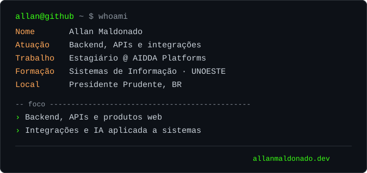

<picture>
  <source media="(prefers-color-scheme: dark)" srcset="dark_mode.svg">
  <source media="(prefers-color-scheme: light)" srcset="light_mode.svg">
  
</picture>

<p align="center">
  Desenvolvedor de Software com foco em backend, APIs e integrações.
</p>

<p align="center">
  <a href="https://allanmaldonado.dev">Portfólio</a>
  ·
  <a href="https://www.linkedin.com/in/allanmaldonado">LinkedIn</a>
</p>

## Sobre

Sou estudante de Sistemas de Informação na UNOESTE e trabalho com desenvolvimento de software. Comecei no frontend, passei por automações e hoje atuo principalmente com backend, APIs e integrações, mantendo experiência em web e mobile.

Atualmente, sou estagiário Full Stack na AIDDA Platforms. 

## Stack

```yaml
backend:     [Python, FastAPI, Typescript, Fastify, Java, Spring]
dados:       [SQL, PostgreSQL, MySQL]
web_mobile:  [TypeScript, React, Next.js, React Native]
ferramentas: [Git, GitLab, Docker]
```
